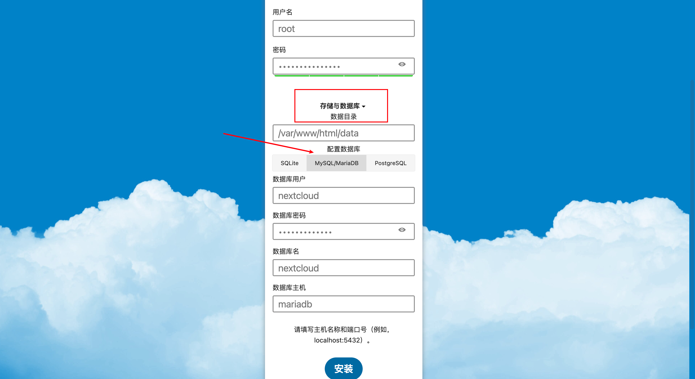

# 搭建属于自己的云存储应用

> 厌倦了群晖服务器？那来试试用nextcloud将云服务器打造成第一个真正属于你的云存储应用吧

## 前置准备

1. 需要有一台云服务器，本文将以阿里云服务器为例
2. 需要有一点docker知识储备，至少要了解docker是什么，提前部署好docker 
3. 放行8088端口（可指定其他端口）
4. 依赖软件：nextcloud、mariadb（可换成mysql）；不需要提前安装，本文会一一介绍如何部署

### 最低配置：

| 配置项 | 建议规格 |
| --- | --- |
| 系统 | centos7.8 |
| 内存 | 2G以上 |
| 磁盘 | 30G以上 |

## 部署NextCloud

### docker 拉取镜像

```bash
# 拉取 nextcloud
sudo docker pull nextcloud
# 拉取 mariadb
sudo docker pull mariadb
# 检查以上镜像是否都拉取完成
docker images
```

### 启用服务

1. 创建并启动mariadb容器，
    1. 使用–name参数命名为mariadb，
    2. --env配置数据库用户名：nextcloud，root用户密码：nextcloud_123（根据个人修改成复杂密码），数据卷轴：nextcloud。
    3. 最后使用–restart=always配置Docker启动服务时mariadb容器随之启动。
2. 创建并启动nextcloud容器，
    1. 使用–name参数命名为nextcloud，
    2. 使用-p参数将NextCloud容器的80端口映射到宿主机8088端口。
    3. --link 创建的nextcloud容器网络连接至mariadb数据库容器。
    4. 最后使用–restart=always配置Docker启动服务时nextcloud容器随之启动
3. docker ps 检查容器是否正常启用，以及浏览器访问http://{{云服务器公网ip}}:8080是否正常显示界面

```bash
# 启动mariadb容器
sudo docker run -it -d --name mariadb --env MARIADB_USER=nextcloud --env MARIADB_PASSWORD=nextcloud_123 --env MARIADB_ROOT_PASSWORD=nextcloud_123 --env MARIADB_DATABASE=nextcloud --restart=always mariadb
# 启动nextcloud容器
sudo docker run -it -d -p8080:80 --name nextcloud --link mariadb --restart=always nextcloud
# 检查
docker ps
```


## 初始化nextcloud

### 创建管理员账号

用户自定义账号密码


### 配置数据库

1. 点击界面中的「存储与数据库」
2. 数据目录填写：nextcloud （docker部署marialdb中配置的数据卷轴名）
3. 点击展开栏中的「Mysql/MarialDB」，填写之前docker部署marialdb中配置的账号密码
    1. username：nextcloud
    2. password: nextcloud_123
    3. database: nextcloud
    4. host: mariadb



1. 点击安装后，初始化完成


## 其他配置

### 准许信任域名
如果不配置该项，将只能通过公网ip访问

1. 进入 docker 容器nextcloud 中
2. 在/var/www/html/config/config.php中找到trusted_domains参数，并添加相应域名
```php
'trusted_domains' =>
     array (
     0 => 'IP:8080',
     1 => 'Domain-Name',
     2 => 'www.Domain-Name',
     ),
```


### 好用的插件
登录管理员用户-用户（右上角头像）-应用
+ office办公套件 - onlyoffice （建议内存只有2g的乞丐机不要尝试，崩了无数次了😭。。。）
+ 启用服务器端数据加密：Default encryption module
+ 支持markdown：notes
+ 查看pdf：PDF viewer
+ 绘制流程图：drawio
+ 思维导图：files_mindmap
+ 两步验证：Two-Factor TOTP Provider


