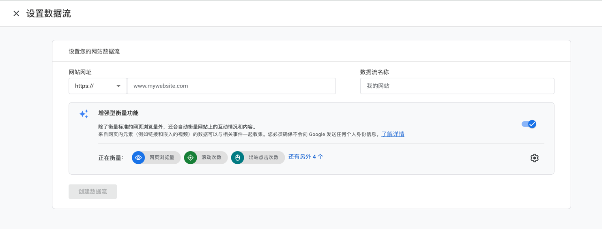
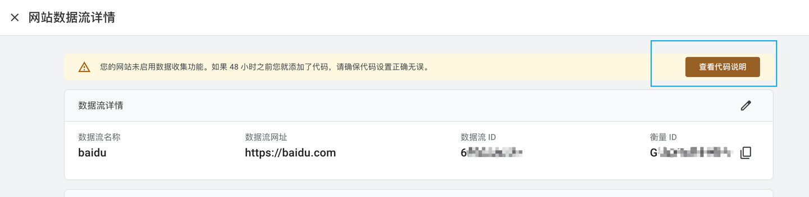
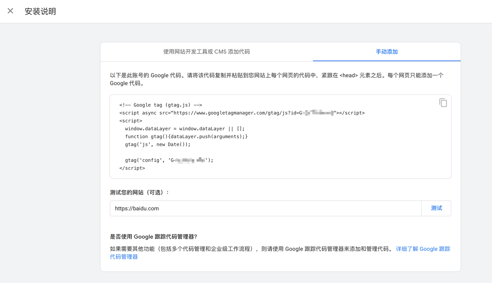
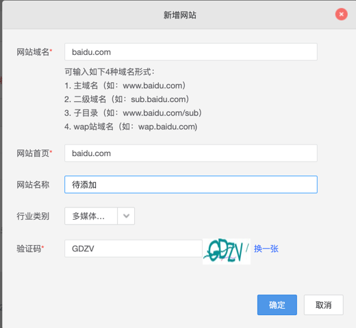
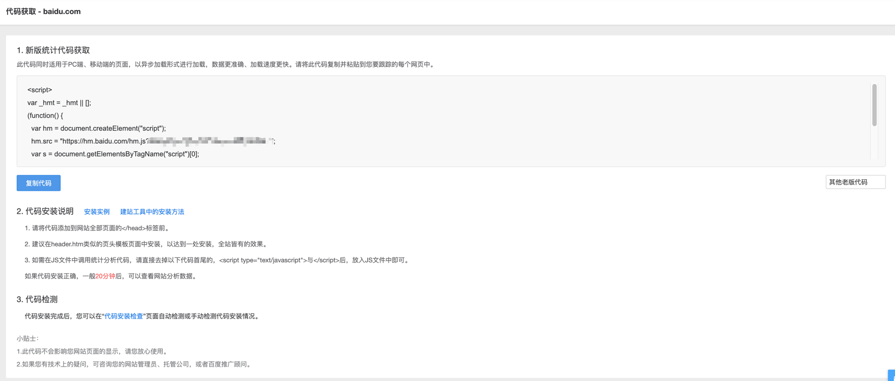
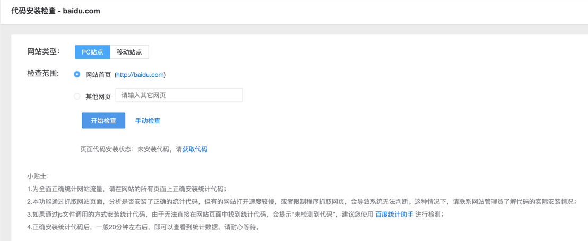

# 网站运维分析工具介绍

## Google Analytics

Google Analytics（分析）平台会从网站或者应用中收集数据，生成可为您的业务提供数据洞见的报告。

### 登陆/注册

- 在[Google Analytics](https://analytics.google.com/)中注册帐号并按照个人需要设置相关配置，这里不过多赘述

### 部署

在注册过程中可能会出现「设置数据流」相关设置，这时就是部署Google Analytics的时候了；

如果注册时没有设置或者需要添加新的网站，也可以在设置-媒体资源设置-数据收集和修改-数据流这一栏中编辑或新增

1. 输入网站网址和想要的数据流名称，点击创建工作流
2. 确认后点击查看代码说明
   
3. 将显示的代码复制到网站每个网页的代码中
   
4. 点击「测试」按钮，验证是否成功部署，显示成功则部署完成可以查看网站访问的相关数据信息了

## Baidu Analytics

与Google Analytics类似的运维分析工具

### 登陆/注册

- 在[百度统计](https://tongji.baidu.com/)中注册帐号并按照个人需要设置相关配置，这里不过多赘述

### 部署

1. 在使用设置-网站列表中点击「新增网站」

   

2. 复制代码到网站每个网页代码中
   
3. 在左侧侧边栏代码管理-代码验证检查中检查是否部署成功，显示成功则部署完成可以查看网站访问的相关数据信息了
   
