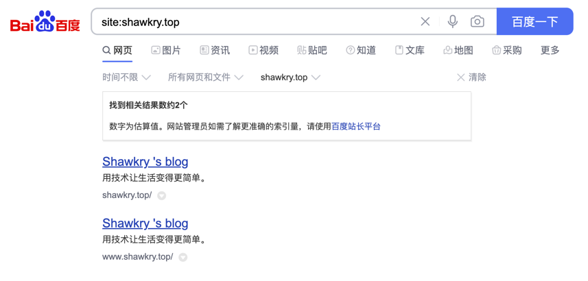
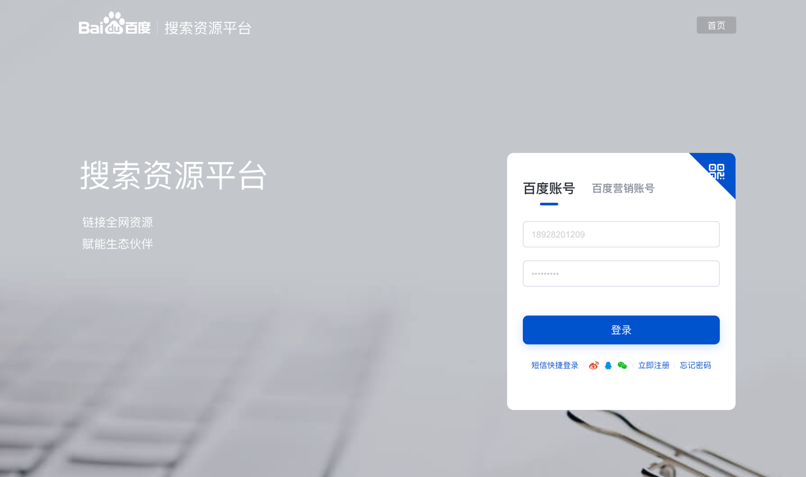
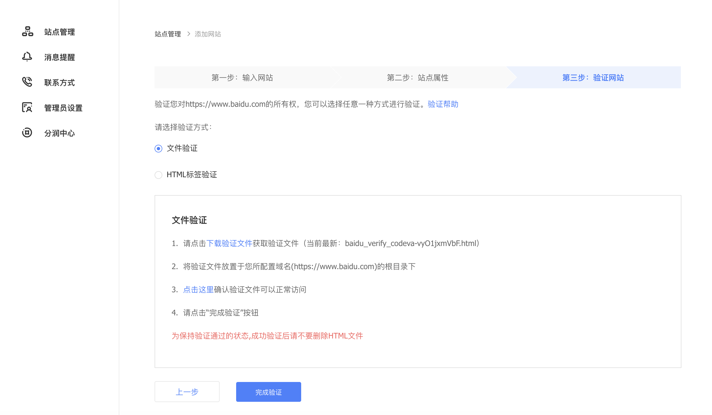
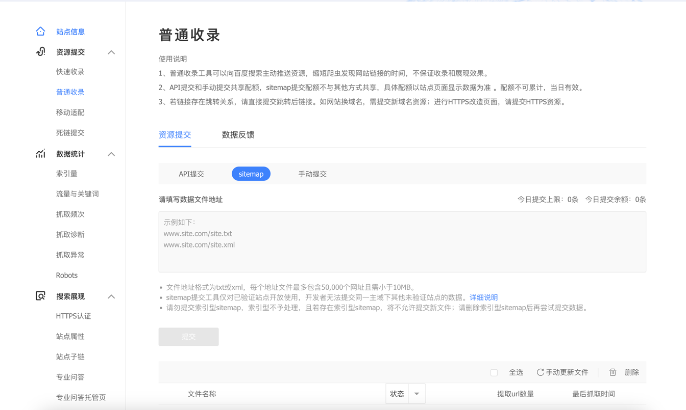
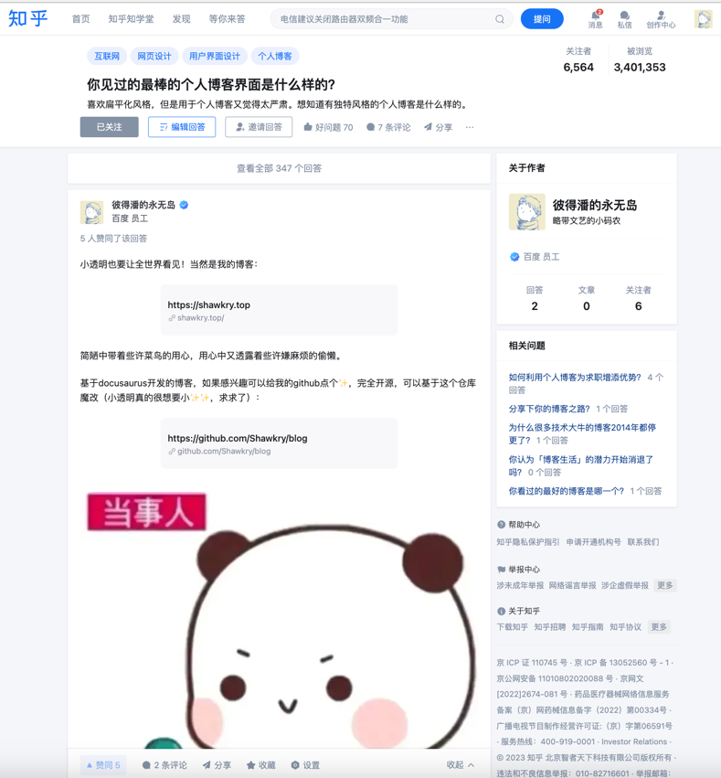
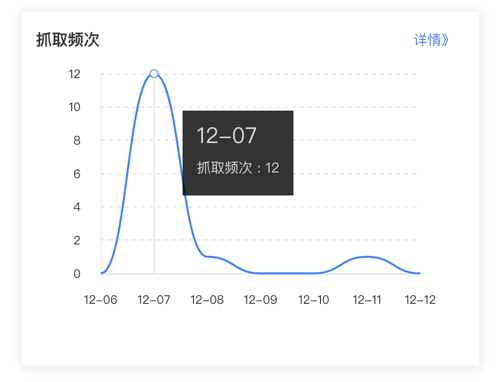

# Baidu 收录

> 有一说一，百度真的没有谷歌好用～（来自前百度员工的小声bb）

## 验证网站是否被收录

打开baidu，在搜索框输入`site:your-web-site`，site后面是你的网站域名

如果有搜索结果证明已经被baidu收录了

如果没有结果则需要我们将网站主动提交给baidu

## 提交网站

### 验证网站所有权

1. 进入 baidu资源搜索平台：https://ziyuan.baidu.com/ 登陆或注册
   

2. 在用户中心-站点管理，点击添加网站
3. 一直点击「下一步」到验证网站所有权，可以「下载文件验证」，也可以在html标签中验证
   

### 提交收录

百度收录分为「快速提交」和「普通提交」，「普通收录」中又分为api提交、sitemap提交、手动提交三种方式，
但目前发现sitemap提交次数一直为0，不知道为什么～，所以我是以手动提交完成收录的😭

## 提高收录成功率

完成以上步骤，其实差不多能做的都已经做了～就看百度收不收录了，但百度并不是所有提交都会收录的，我们需要一些额外的手段去让百度看到我们！（看看隔壁谷歌，好好反思一下百度😠）

### 域名备案

如果是没有备案的域名，百度一般是不会收录的～所以国外域名的所有者需要格外注意这一点

### 优质外链

在提交网站之后，大概一个月的时间里，谷歌早就收录了，而百度瞧都没瞧我的网站一眼💔，在分析了一下之后，决定通过外链的形式吸引一些用户跳转，让百度能顺着链接抓取到我们。

于是我在知乎上写了一篇回答：[你见过的最棒的个人博客界面是什么样的？](https://www.zhihu.com/question/29755481/answer/3299607433?utm_id=0)

有了一定的访问量之后，百度，终于，收录了我的网站😭

