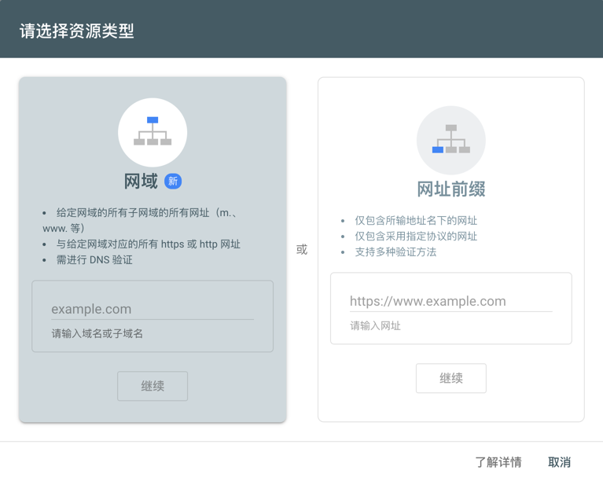

# Google 收录

> 自己搭建的网站一般是不会被Google收录的，山不向我走来我向山走去，我们可以自己主动把网站提交给Google

## 验证网站是否被收录

首先我们可以先验证一下我们的网站是否有被Google收录，如果被收录了，那就可以不用往下看了🐶

只需要一步就能验证出来，在Google搜索中输入：`site:your-web-site`

**已经收录例子🌰：**

可以看到这里搜索`site:shawkry.top`是有一条结果的，证明我们已经加入了Google大家庭。

**未收录例子🌰：**

当我们更换一个域名测试，显示「找到约 0 条结果」，那就证明咱们暂时还是个小透明。

## Google Search Console

本文主角：[google search console](https://search.google.com/)

### 介绍

Search Console 是 Google 推出的一款工具，可以帮助任何拥有网站的用户了解其网站在 Google 搜索中的表现，以及如何改进网站在 Google 搜索上的呈现效果，使网站获得更相关的流量。

### 作用

- 向Google提交网站，让Google能够抓取你的网站
- 查看编制索引，以便即使调整网站内容和未收录原因
- 不需要装第三方软件就能查看网站的搜索流量数据
- 查看其他外部网站链接到本站的情况

### 添加网站

一、登陆并添加网站

登陆[Google Search Console](https://search.google.com/)，在首页点击添加“资源”，根据实际情况添加自己网站的网址，这里我们选择「网域」，将网站网址输入到框内。

二、验证网站所有权

1. 选择记录类型：TXT
2. 登录到域名提供商网站，如阿里云、腾讯云等
3. 将 TXT 记录复制到 DNS 配置中
   
4. 完成以上操作，回到 Search Console 按下验证按钮(可能不会立刻成功，需要过一段的时间)

三、添加站点地图

1. 将sitemap.xml放在可以服务器能访问的位置
2. 在search console的左侧侧边栏中，点击编制索引-站点地图
3. 输入sitemap.xml地址，并点击确认
   

如果不了解什么是sitemap.xml，可以查看Google的官方文档介绍，里面有详细的说明和如何创建的教程：[站点地图](https://developers.google.com/search/docs/crawling-indexing/sitemaps/overview?hl=zh-cn)
:::warning
添加站点地图sitemap.xml是一定要完成的操作步骤，我最开始以为非必要项没有提交，结果等了一个月网站还没被Google收录😭
:::
四、等待🐶

完成以上步骤基本上没有问题了，新域名大概需要一个星期或者更长的时间，届时Google会发邮箱到你所登陆的帐号，在这期间也可以自己验证网站是否被收录，参考：[验证网站是否被收录](#验证网站是否被收录)
