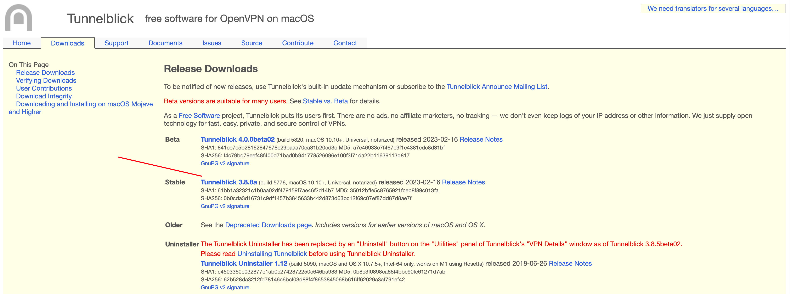
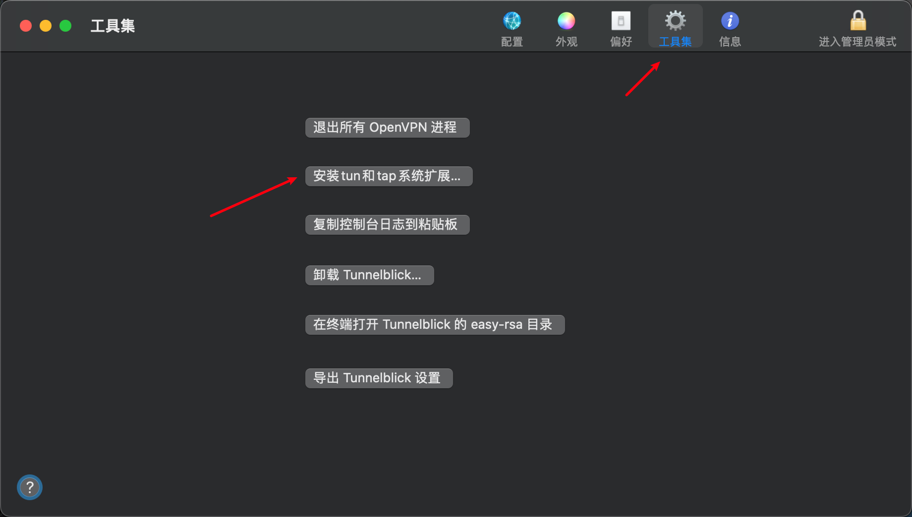
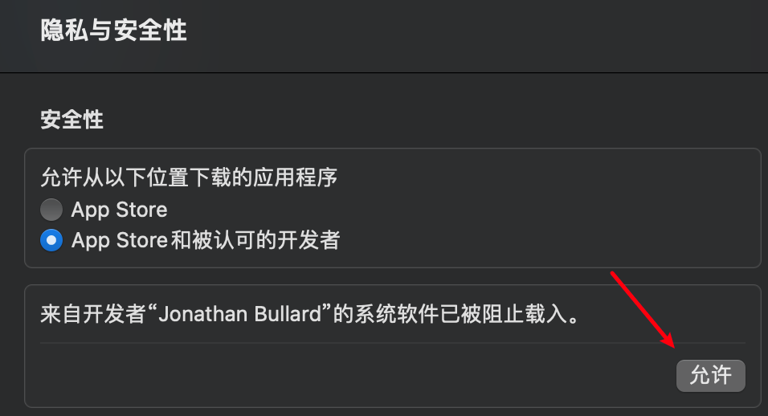

# Mac 客户端搭建

:::info
推荐安装版本：N2N V3

大体分为三个部分：N2N的编译、系统扩展授权和tun/tap安装

tun/tap不再维护，Apple Chip无法正常安装，使用Tunnelblick创建内核扩展解决这个问题
:::

## 使用brew安装相关必要工具

```bash
# 无brew，使用以下命令安装brew，有则忽略
/bin/bash -c "$(curl -fsSL https://raw.githubusercontent.com/Homebrew/install/HEAD/install.sh)"
# 安装openssl和cmake
brew install openssl
brew install cmake
```

## N2N源码下载与编译

1. 下载N2N源码

```bash
git clone https://github.com/ntop/n2n.git
cd n2n
git checkout 3.0-stable
```

1. 编译N2N

```bash
#在n2n目录中创建build目录
mkdir build
cd build
cmake -DOPENSSL_ROOT_DIR=/usr/local/opt/openssl ../
# 由于权限问题，make install 会出现错误 file cannot create directory: /usr/share/man8.  Maybe need administrative
# 手动将CMakeLists.txt中所有的/usr/share/替换为/usr/local/share/，之后在执行make install
sudo make install
```

1. 验证是否安装成功

```bash
edge

Welcome to n2n v.3.0.0.r1044.6dac89f for Darwin
Built on Apr  9 2023 12:22:38
Copyright 2007-2021 - ntop.org and contributors

   basic usage:  edge <config file> (see edge.conf)

            or   edge  -c <community name>
                       -l <supernode host>:<port>
                      [-a <tap IP address>]
                      [-k <encryption key>]

  -h    shows a quick reference including all available options
 --help gives a detailed parameter description
   man  files for n2n, edge, and superndode contain in-depth information
```

## 启用系统扩展

相关链接：[如何启用系统扩展](https://support.apple.com/zh-cn/guide/mac-help/mchl768f7291/mac)

关键步骤：

- 选取苹果菜单 >“关机”，按住电源按钮直至“正在载入启动选项”出现
- 点按“选项”，然后点按“继续”
- 选择管理员帐户，然后点按“下一步”，输入管理员帐户的密码，然后点按“继续”；
- 选取左上角“实用工具”>“启动安全性实用工具”；
- 选择“降低安全性”>“允许用户管理来自被认可开发者的内核扩展”；
- 选取苹果菜单 >“重新启动”即可

## 安装 Tunnelblick

url：[https://tunnelblick.net/downloads.html](https://tunnelblick.net/downloads.html)



1. 安装tun/tap系统扩展



1. 点击允许之后会重启



1. 重启后，加载驱动

```bash
sudo kextload /Library/Extensions/tunnelblick-tap.kext
# 验证是否tuntap驱动是否已经加载，有返回证明成功
kextstat | grep tun
```

## 启动N2N

1. 进入n2n/build目录，新建配置文件edge.conf

```bash
# 相关可配置参数
-a <mode:address>        | n2n网卡的ip地址，即本机的n2n的ip。直接填写IP或者使用 DHCP '-r -a dhcp:0.0.0.0'
-c <community>           | n2n组，只有相同组的edge之间才能进行通讯
-k <encrypt key>         | edge的加密密码
-s <netmask>             | 子网掩码 可选 (255.255.255.0).
-l <supernode host:port> | supernode的ip和端口
-i <reg_interval>        | 注册时间间隔，用于NAT打洞(默认为20秒)
-L <reg_ttl>             | 当通过超级节点UDP NAT打洞时，注册数据包的TTL(默认0不设置)
-p <local port>          | 固定本地UDP端口
-u <UID>                 | 如果不想用root来运行edge，则可指定本机账号的uid，windows下可忽略
-g <GID>                 | 如果不想用root来运行edge，则可指定本机账号的groupid，windows下可忽略
-f                       | 带-f时前台运行，不添加-f 参数时作为守护进程运行
-m <MAC address>         | n2n虚拟网卡的MAC地址，默认随机设置
                         | eg. -m 01:02:03:04:05:06
-M <mtu>                 | MTU 值，默认1290
-r                       | 启用数据转发功能，当需要访问该设备的局域网时需要设置
-A1                      | 禁用载荷加密。不能与key 同时使用(默认为Twofish)。
-A2 ... -A5 or -A        | 选择有效载荷加密的密码，需要一个密钥:-A2 = Twofish(默认)，
                         | -A3 or -A (deprecated) = AES-CBC, -A5 = Speck-CTR.
-H                       | Enable full header encryption. Requires supernode with fixed community.
-z1 ... -z2 or -z        | Enable compression for outgoing data packets: -z1 or -z = lzo1x (default=disabled).
-E                       | 接受多播MAC地址(默认=drop)
-S                       | 不要连接P2P ，总是使用超级节点转发数据
-n <cidr:gateway>        | 通过gw路由IPv4网络。使用0.0.0.0/0作为默认gw。可多次设置。
-v                       | 详细日志
-t <port>                | 管理UDP端口(用于机器上的多个edges)。

环境变量:
  N2N_KEY                | 加密密钥(ASCII)
```

1. N2N启动

```bash
sudo ./edge ./edge.conf
```

1. 测试N2N是否成功搭建

```bash
# 验证是否tuntap驱动是否已经加载，有返回证明成功
kextstat | grep tun
# 查看进程
sudo lsof edge
# ping需要连接的客户端ip，比如192.168.66.1，没有出现timeout则说明连接成功
ping 192.168.66.1
```

## 🚧 实现一个脚本，简化流程
