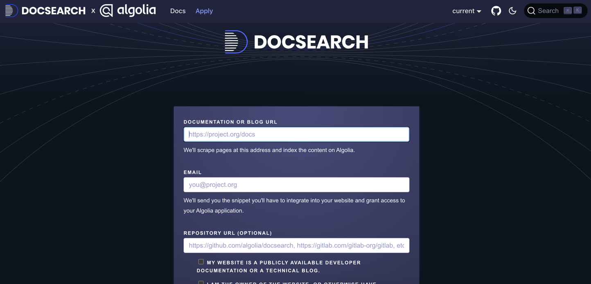
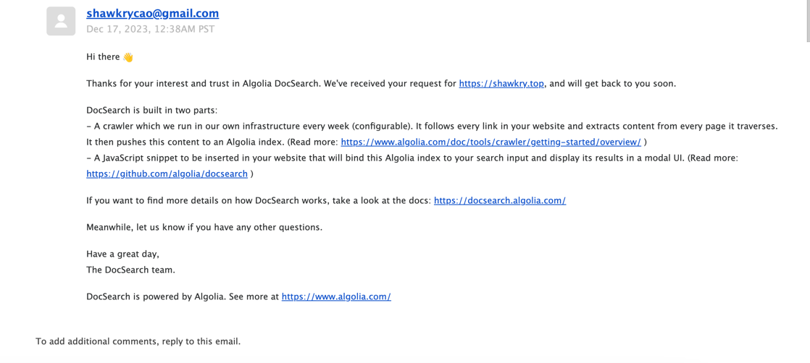
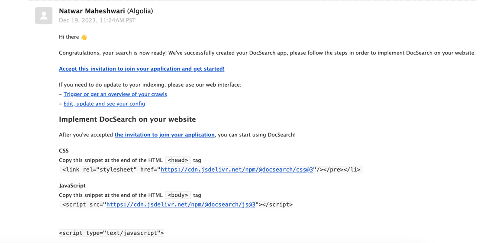
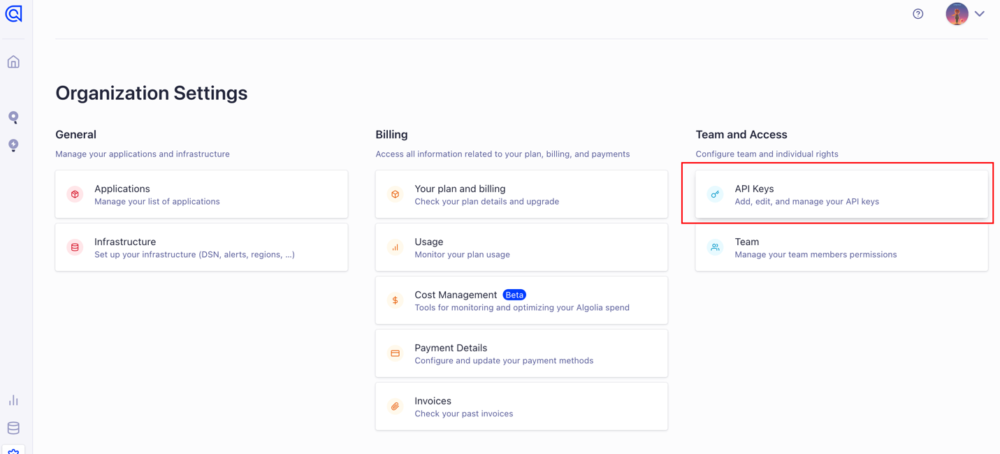
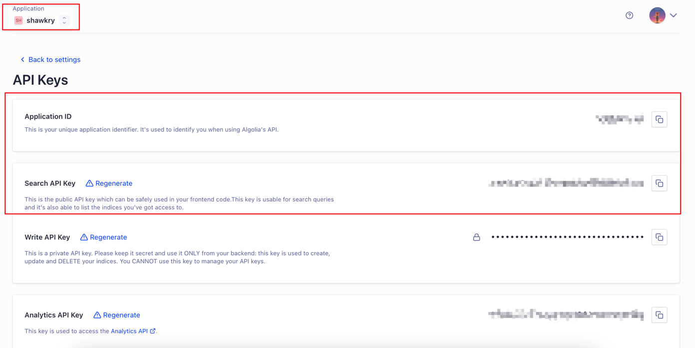
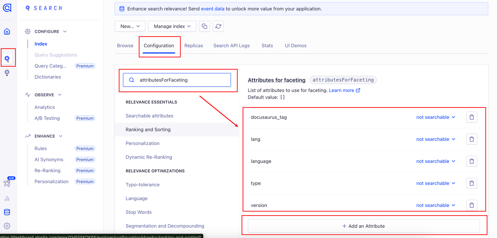
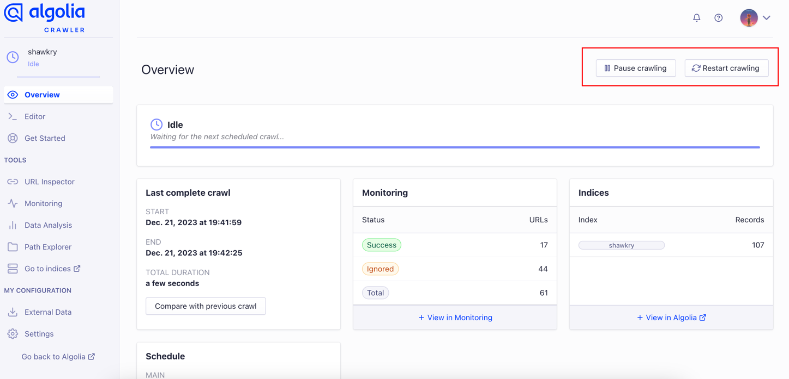
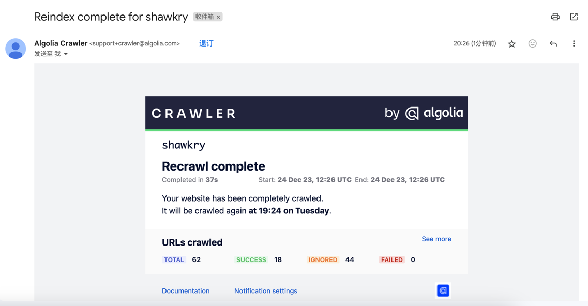

# 为文档网站提供站内搜索功能

## Algolia 是什么

Algolia 是一家为网站与移动应用提供托管式搜索API的美国企业，专注于提供高效、快速和可定制的搜索功能，针对开源项目提供一定的免费服务。

## 申请

:::info
Algolia只针对开源项目免费，如果不开源的话是需要付费的
:::

开源项目可以直接申请加入：https://docsearch.algolia.com/apply/



按照实际情况填写表单后，点击「Join the program」提交表单，提交成功之后会发送邮件到你所填写的邮箱中



## 获取API Keys

大概三个工作日左右，Algolia会再次回信到你的邮箱，我看到网上教程都说需要对邮件回信，但亲自尝试之后发现其实并不需要回信，邮件内容大致如下：


点击邮件中的「Accept this invitation to join your application and get started!」，会跳转到 Algolia 登录界面，之后再在左边侧边栏进入「setting」页面，再点击「API keys」选项


获取相应keys，主要是「Application ID」、「Search API Key」、「Application」



## 部署

### Docusaurus

如果是 Docusaurus 项目，那么需要「Application ID」和「Search API Key」和 「Application」

在 `docusaurus.config.js` 文件中添加al参数

```json5
{
  themeConfig: {
    // ...
    algolia: {
      appId: "", // Application ID
      apiKey: "", // Search API Key
      indexName: "", // Application
    },
    // ...
  },
}
```

添加 Algolia 主题

```bash
pnpm i @docusaurus/theme-search-algolia
```

### 其他文档项目

根据 algolia 发送的邮件在项目中添加html片段，填写上述获取到的三个API Keys，如果该文档框架有相应的插件也可以直接使用插件的形式

```html
<!--CSS文件，放在head标签中-->
<link rel="stylesheet" href="https://cdn.jsdelivr.net/npm/@docsearch/css@3"/></pre></li>

<!--JS脚本，放在body标签中-->
<script src="https://cdn.jsdelivr.net/npm/@docsearch/js@3"></script>
<script type="text/javascript">
  docsearch({
      appId: , // Application ID
      apiKey: , // Search API Key
      indexName: , // Application
  });
```

## 踩坑记录

如果是 Docusaurus 项目，做完上述步骤，发现实际搜索，搜索结果一直都为空的话，大概率可能是 algolia 爬虫配置某些字段不完全，可以参考这个老哥的解决方案，应该能解决这个问题：https://github.com/facebook/docusaurus/issues/6693

需要在 algolia 手动添加参数一些参数，如下图：


记得保存之后重启一下 algolia 爬虫，如果不知道怎么重启可以看下面一个小节

## 使用

algolia 会每周自动爬取一次，如果想手动更新也是可以～

登录：[Crawler Admin Console](https://crawler.algolia.com/admin/crawlers)

点击 Restart crawling 重启爬虫


完成后会发送邮件到你的邮箱中

