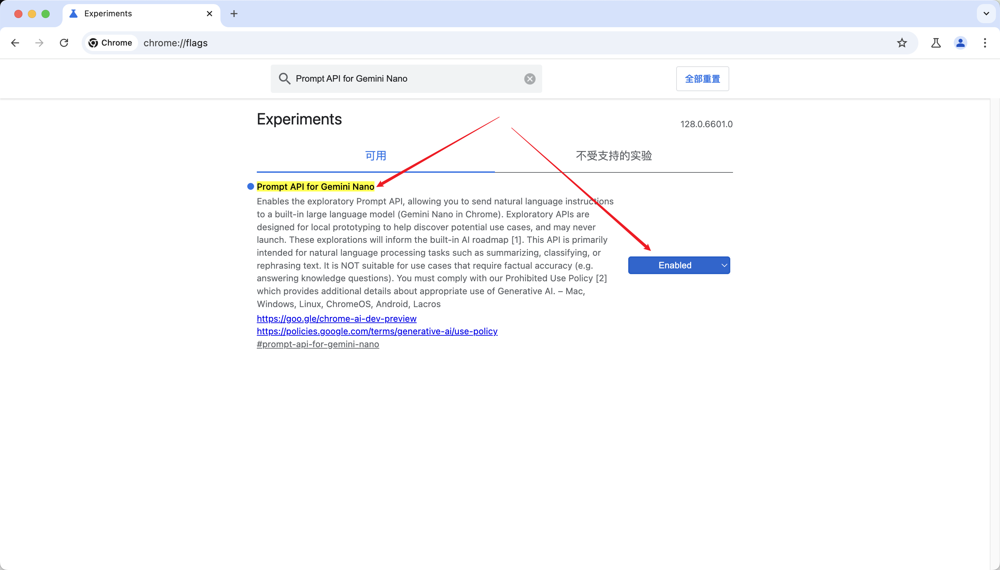
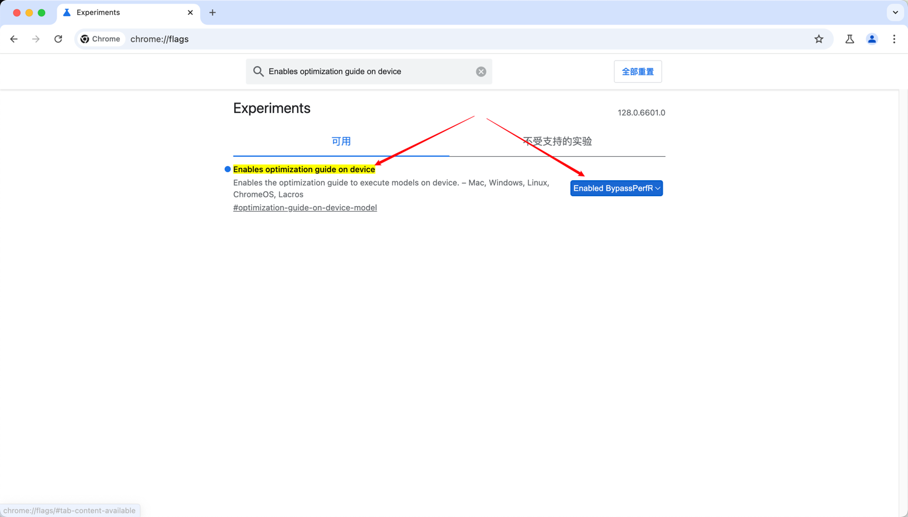
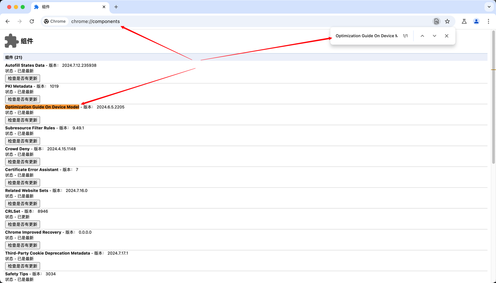
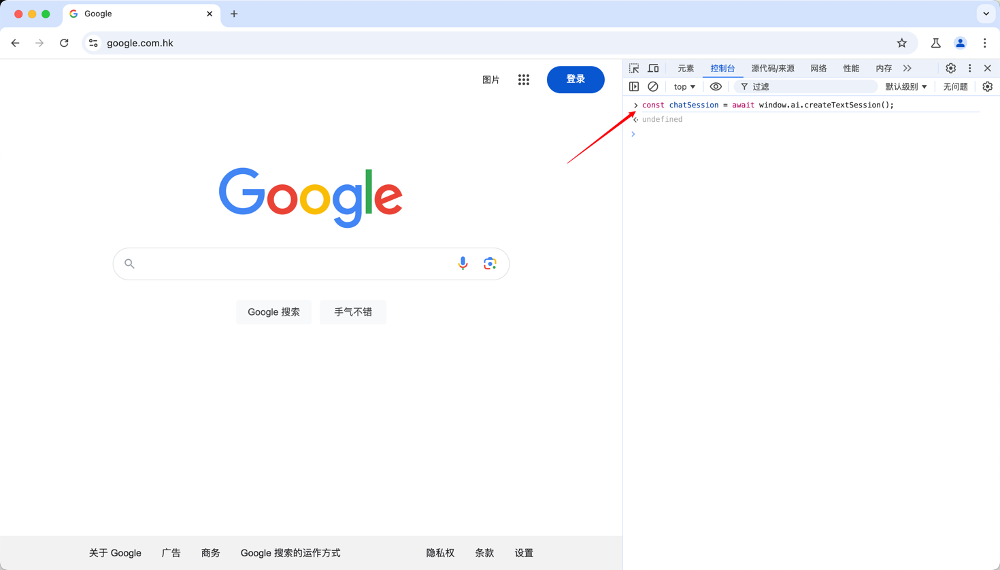
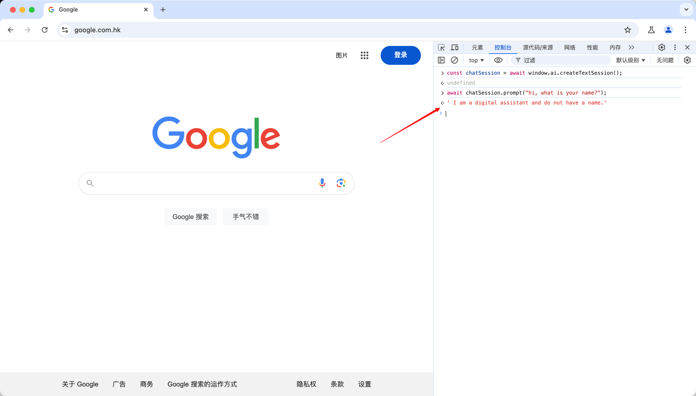
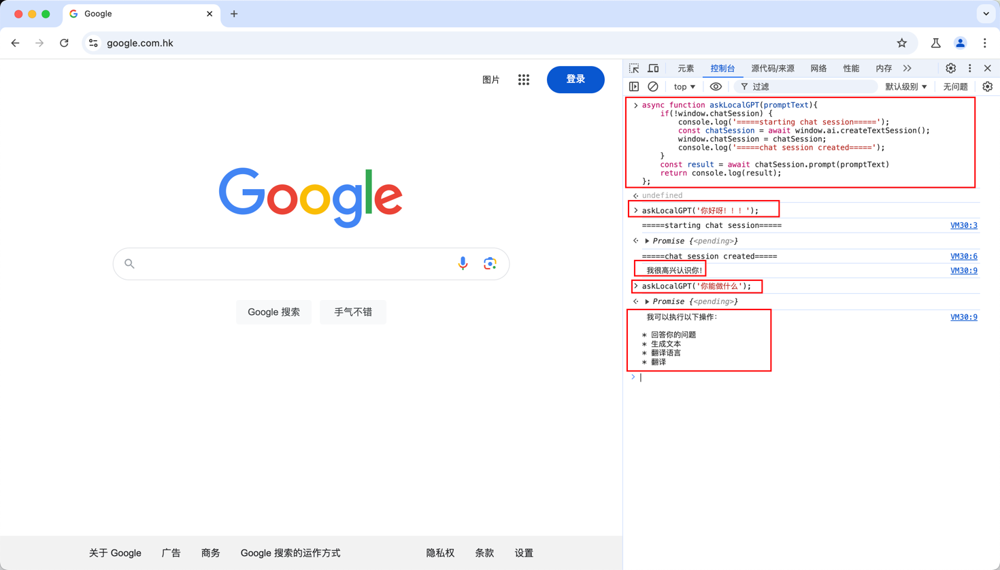

# window.ai-浏览器上本地运行AI

> 没有网络？没有关系，打开浏览器，打开控制台，直接调用 Google 官方提供的 LLM API

## 前言

在安装时不确定是否需要科学上网，如果有必要请打开🪜。

Gemini Nano 本身大小为 1.5G，Chrome并不会显示它的大小，留意存储空间以及网速。

## 安装 Chrome Canary

正式版的 Chrome 还没有提供相关的功能，所以我们需要下载 Chrome Canary 提前体验。

下载地址：[Chrome Canary](https://www.google.com/intl/en_uk/chrome/canary/)

## 启用相关 Chrome 配置

### 启用 Prompt API for Gemini Nano

1. 打开 Chrome Canary 并在 URL 栏中输入 chrome://flags/
2. 在顶部的搜索框中输入： Prompt API for Gemini Nano
3. 将其设置为“Enabled”



### 启用 Enables optimization guide on device

1. 打开 Chrome Canary 并在 URL 栏中输入 chrome://flags/
2. 在顶部的搜索框中输入： Enables optimization guide on device
3. 将其设置为“Enabled ByPassPerfRequirement”
4. 重启 Chrome Canary

:::info
需要注意是设置成 Enabled ByPassPerfRequirement ，而不是 Enabled
:::



## 安装 Gemini Nano

完成上述配置设置之后，在 Chrome Canary 就能显示 Gemini Nano的安装入口。

1. 打开 Chrome Canary 并在 URL 栏中输入 chrome://components/
2. 按住 ctrl + f 或者 command + f 在页面中国呢搜索 Optimization Guide On Device Model
3. 点击检查是否有更新，然后 Chrome Canary 就会开始下载 Gemini Nano，等待「状态」变成 「已是最新」就说明已经下载完成
4. 重启 Chrome Canary



## 使用window.ai

如果完成上述所有的准备工作，我们就可以开始在控制台使用window.ai了。现在让我们使用 F12 打开 Chrome Canary 的控制台。

### 创建第一个ai会话

在控制台输入

```javascript
const chatSession = await window.ai.createTextSession();
```



如果输入命令后有任何报错，请检查上面的准备工作是否有哪一步没有做好，特别是检查 Gemini Nano 是否成功安装。

### 开始ai对话

继续在控制台输入以下命令之后，就能和 Gemini Nano 正常对话了：

```javascript
await chatSession.prompt("hi, what is your name?");
```



### 封装一个快速对话的函数

```javascript
async function askLocalGPT(promptText){
    if(!window.chatSession) {
        console.log('=====starting chat session=====');
        const chatSession = await window.ai.createTextSession();
        window.chatSession = chatSession;
        console.log('=====chat session created=====');
    }

    return console.log(await chatSession.prompt(promptText));
};
```



## 总结

和 ChatGPT、Claude、Gemini 等 AI 工具比起来，它显得像是一个比较新颖的小玩具。

它对中文问题的回答准确度很低，有时候返回的回答会牛头都不对马嘴，也好像完全没有上下文的概念。。。

它的优势就只是不需要联网，调用API不用付费，是本地AI，浏览器AI的一种探索，有兴趣的话还是可以玩一下的。

参考文章：https://dev.to/grahamthedev/windowai-running-ai-locally-from-devtools-202j


