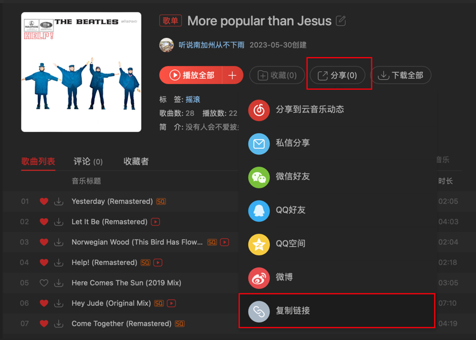
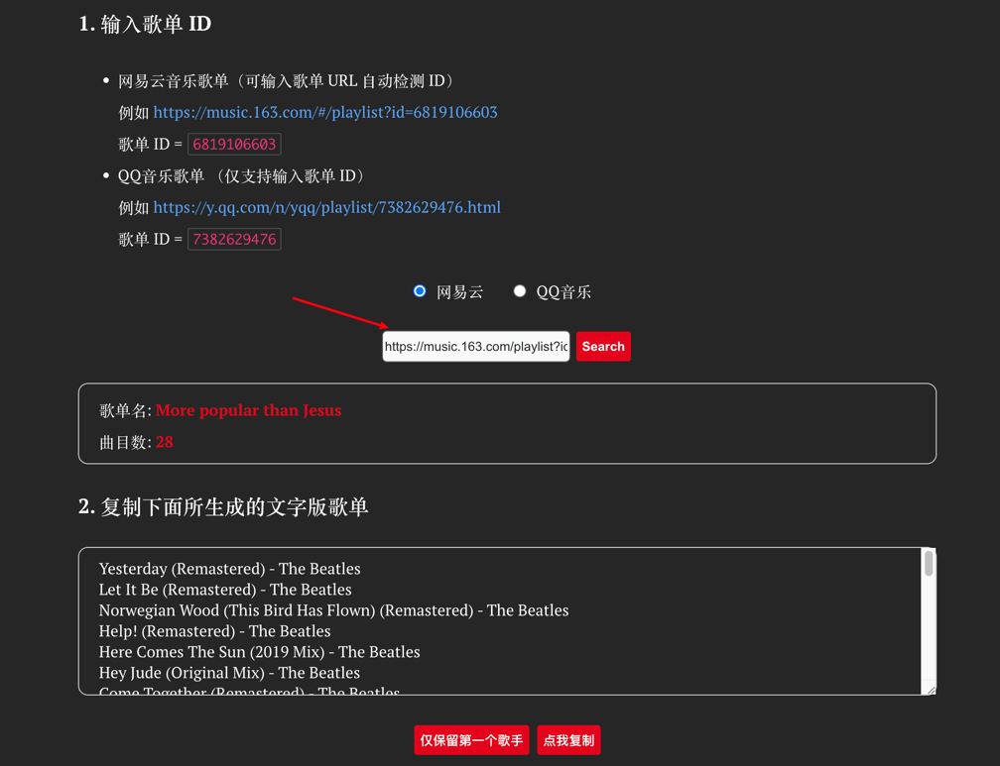
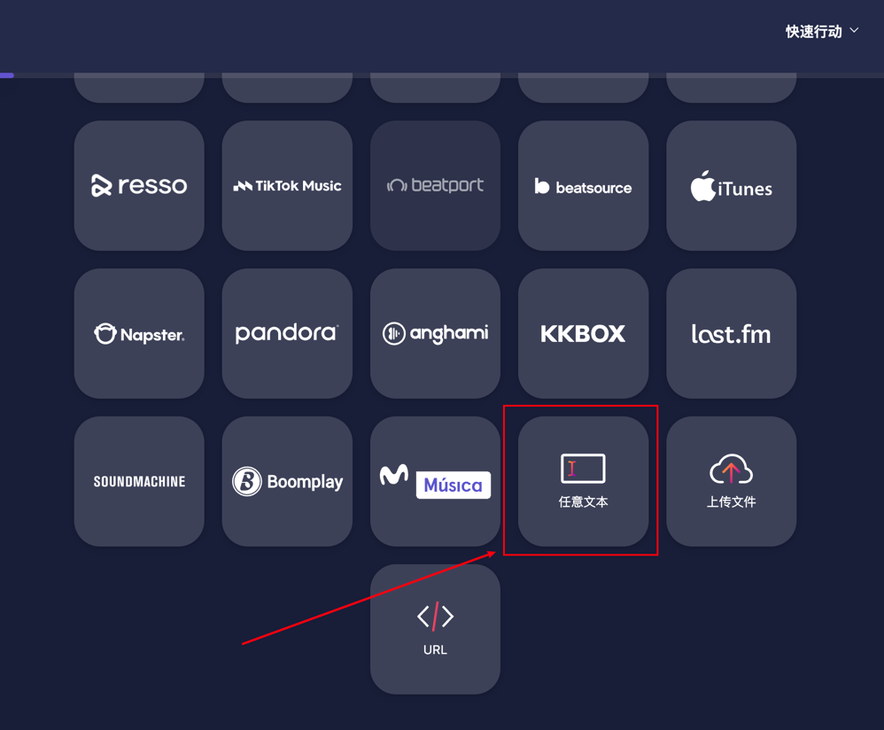
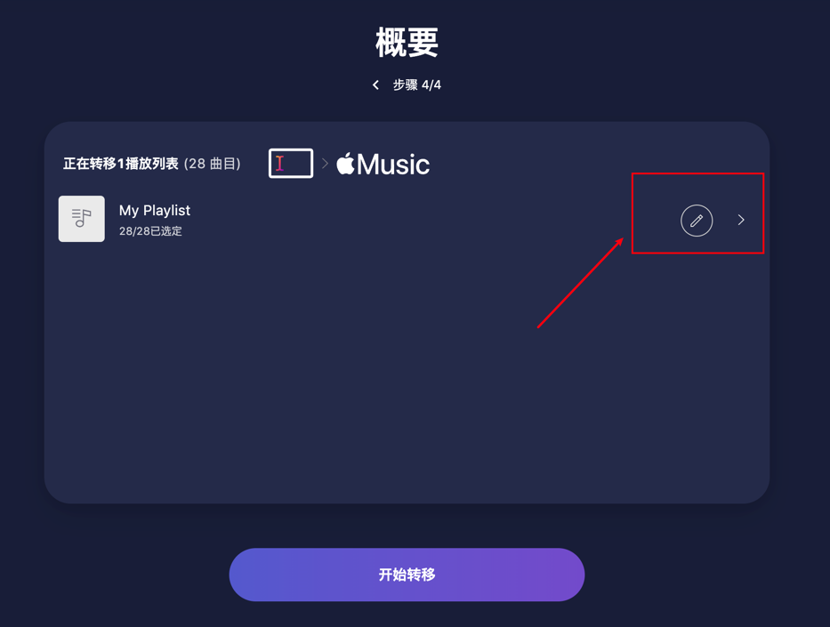
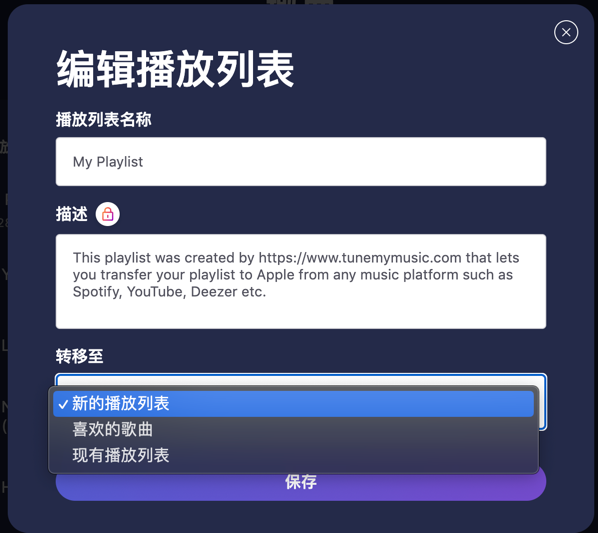

# 转移歌单到apple music

> 和动不动就下架音乐的版权荒漠网易云音乐 say bye bye！

## 需求和适用范围说明

使用了多年的网易云音乐或者qq音乐，现在想换平台，多年的歌单里几千首音乐也需要跟着转移到新平台。

兼容的平台：

| 平台名称          | 作为转出 | 作为转入 |
|---------------|------|------|
| 网易云音乐         | ✅    | ❌    |      
| QQ音乐          | ✅    | ❌    |     
| apple music   | ✅    | ✅    |     
| youtube music | ✅    | ✅    |     
| spotify       | ✅    | ✅    |     
 
> PS：网易云音乐和QQ音乐需要多一步操作，下面会详细讲解如何操作。

## 具体实现

转移工具：[tunemymusic](https://www.tunemymusic.com/)

歌单转文本工具：[n2s](https://yyrcd.com/n2s/)

1. 复制歌单分享链接，以网易云音乐为例：

2. 打开[歌单转文本工具](https://yyrcd.com/n2s/)，粘贴链接，并复制生成文本

3. 打开[转移工具](https://www.tunemymusic.com/)，在「选择来源」这一步骤向下拉，找到「任意文本」这一选项

4. 粘贴歌单文本
5. 选择转出平台为apple music
6. 在最终确定界面，可以编辑歌单名称、是否新建歌单、选择已有歌单等

7. a few moments later，导入成功

## 注意事项
1. 非会员一次最多迁移500首歌曲
2. 因为是文本导入，所以可能会存在失败或者导入不精准情况，需要迁移后人工再检查一次（要什么自行车🚴）
3. 亲测日本相关的歌曲准确迁移概率极低，需要特别注意，这个和apple music本身有关（日语、罗马音、英语非常混乱）

