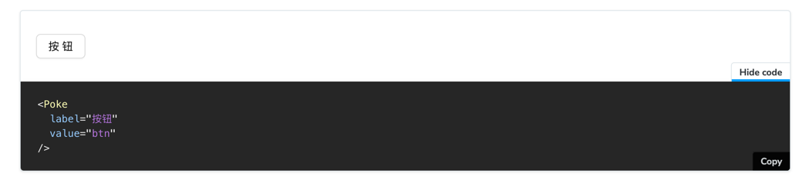

# 实现组件库文档

## 相关链接🔗

storybook：https://storybook.js.org/

storybook官方教程：https://storybook.js.org/docs/react/get-started/why-storybook

## 初始化storybook

在原先的elephant-design项目下运行

```shell
npx storybook@latest init
```

可以看到在src下新增了一个`stories`的目录，仓库文件目录如下：

```
|-- .storybook
|-- public
|   |-- favicon.ico
|   |-- ...
|
|-- src
|   |-- Poke.tsx
|   |-- types
|   |--...
|
|-- stories
    |-- Button.stories.ts
    |-- Button.tsx
    |-- button.css
    |...
```

## storybook 组件文档内容结构

了解了仓库文件目录，应该知道我们新编写的组件文档应该放置在stories目录中，而我们内容组件文档的内容按照约定的结构进行编写。

- Meta 声明组件的定义
- 前端组件描述
  - Props说明
  - 参数控制调试，如需数据源可结合Mock数据调试展示效果
- 前端组件数据源Provider
  - Props说明
  - 调试方式待定，需等待Provider实现完善后再更新
- 工具库方法
  - 方法参数定义和说明
  - 结合参数和预定义的Mock数据，页面展示调用方法的运算结果
- 后端能力
  - 方法的定义和参数说明
  - 流程图/时序图说明，如果一个组件既有前端组件也有后端能力，时序图可以提升到顶层

更多部分可以参考官方教程和初始化storybook自动生成的示例组件文档，使用组件请勿直接引用用src目录下的组件，因为直接这样引用的组件可能是未发布组件，需要引用npm上已经发布的组件

## MDX文档中使用storybook内置组件

除了使用`xxx.stories.ts`的方式编写storybook文档，还可以使用MDX格式进行编写，MDX文档是可以同时记录组件和编写故事的格式。内容的展示顺序根据编写的内容顺序，即Markdown基本一致，只是在Markdown基础上增加了JSX的兼容，可以在文件内编写JSX的代码。

MDX语法高亮编辑器插件

- VsCode插件：[VsCode-MDX](https://marketplace.visualstudio.com/items?itemName=unifiedjs.vscode-mdx)
- WebStorm插件：[MDX](https://plugins.jetbrains.com/plugin/14944-mdx)

以下是storybook提供的内置组件，我们通过内置组件快速生成展示和控制的内容：

### Meta

```
<Meta title="MDX/Button" />
```

定义当前组件的信息、Story默认配置。

`title`：定义当前组件所在左侧导航的菜单层级，必选项。若title中有/ ，则其前的名称为分组名。如上，MDX为分组名，组件名为Button 。

`component`：定义当前组件中所有Story将绑定的组件，用于Story自动获取组件的属性，以便作为表格展示字段或Control控制字段修改。除非有必要，一般会在具体的Story中定义argTypes实现。

`argTypes`：定义当前组件中所有Story的字段默认定义，以便作为表格展示或Control控制字段修改，除非有必要，一般会在具体的Story中定义argTypes实现。

### Story

为组件生成一个故事，故事内容为组件接收某些参数渲染出来的效果。同时，左边导航栏会新增一个与name同名的菜单名称。

```
<Story name="Button">
  <Button label="test123"/>
</Story>
```

如果不希望新增左侧导航新增一个菜单，就不要用包裹，直接使用组件即可：

```
<Button label="test123"/>
```

`args`：使用args参数，实现故事中的组件展示效果可以通过Canvas模式下的Control进行动态控制。但需要改造Story的子组件为可接受参数，如下：

```
<Story name="test1Button" args={{label: 'test123'}}>
    {(args) => <Button {...args} />}
</Story>
```

> args中定义初始值，在Controls可以修改为其他的值。

`argTypes`：支持自定义Control的字段，storybook自动根据故事中的组件Props生成可控制字段，但是我们可以添加字段说明或覆盖默认生成的说明：

```
<Story argTypes={{
    [fieldName]: {
        name: '字段名称',
        description: '字段描述文本',
        table: {
            category: '在表格中分类名，缺省为无分类',
            type: {
               summary: '表格展示字段类型文本',
            },
            defaultValue: {
               summary: '默认值',
            },
        },
        control: {
            type: 'control控制时，控件类型',
        },
      }
    }}
</Story>
```

字段解释：

| 字段                         | 描述                                             | 可选值/类型      | 案例                                                                       |
|----------------------------|------------------------------------------------|-------------|--------------------------------------------------------------------------|
| name                       | 属性的名称。                                         | string      | \{ label: \{ name: 'label' \} \}                                         |
| type.required              | 将属性设置为可选或必需。                                   | boolean     | \{ label: \{ type: \{ required: true \} \}                               |
| description                | 设置属性的 Markdown 描述。                             | string      | \{ label: \{ description: 'Something' \} \}                              |
| table.type.summary         | 提供该类型的简短版本。                                    | string      | \{ label: \{ table: \{ type: \{ summary: 'a short summary' \} \}\}\}     |
| table.type.detail          | 提供该类型的扩展版本。                                    | string      | \{ label: \{ table: \{ type: \{ detail: 'string' \} \}\}\}               |
| table.defaultValue.summary | 提供默认值的简短版本。                                    | string      | \{ label: \{ table: \{ defaultValue: \{ summary: 'Hello World' \} \}\}\} |
| table.defaultValue.detail  | 提供更长版本的默认值。                                    | string      | \{ label: \{ table: \{ defaultValue: \{ detail: 'Something' \} \}\}\}    |
| table.category             | 提供字段在表格中是否放置在单独分类下，默认是无分类                      | string      | \{ label: \{ table: \{ category: 'Event'\}\}\}                           |
| control                    | 关联属性的控件类型。 可帮助控制值进行组件调试。更多配置查看以下的ControlType可选 | ControlType | \{ label: \{ control: \{ type: 'text'\} \} \}                            |

Props属性的type与控件可选类型的定义：

| props属性类型 | control控件可选类型 | 描述                                                                            | 案例                                                                                            |
| ------------- | ------------------- | ------------------------------------------------------------------------------- | ----------------------------------------------------------------------------------------------- | --- |
| boolean       | boolean             | 提供一个Switch控件切换状态。                                                    | argTypes: \{ active: \{ control: 'boolean' \}\}                                                 |
| number        | number              | 提供一个数字输入框控件来控制，还可以给控件设置范围和步长。                      | argTypes: \{ even: \{ control: \{ type: 'number', min:1, max:30, step: 2 \} \}\}                |
|               | range               | 提供一个Slider滑动条控件来控制数值。                                            | argTypes: \{ odd: \{ control: \{ type: 'range', min: 1, max: 30, step: 3 \} \}\}                |     |
| object        | object              | 提供一个多行文本框，输入内容是需要满足JSON规范。                                | argTypes: \{ user: \{ control: 'object' \}\}                                                    |
| array         | object              | 提供一个多行文本框，输入内容是需要满足JSON规范，用户输入约定输入数组。          | argTypes: \{ odd: \{ control: 'object' \}\}                                                     |
|               | file                | 提供一个文件控件，选择后会返回文件blob URL列表，还可自定义文件类型。            | argTypes: \{ avatar: \{ control: \{ type: 'file', accept: '.png' \} \}\}                        |     |
| enum          | radio               | 提供一个单选radio控件，通过options提供可选值。                                  | argTypes: \{ contact: \{ control: 'radio', options: \['email', 'phone', 'mail'\] \}\}           |
|               | inline-radio        | 与radio一样，只是单选项布局是inline。                                           | argTypes: \{ contact: \{ control: 'inline-radio', options: \['email', 'phone', 'mail'\] \}\}    |     |
|               | check               | 提供一个多选check控件，通过options提供可选值。                                  | argTypes: \{ contact: \{ control: 'check', options: \['email', 'phone', 'mail'\] \}\}           |     |
|               | inline-check        | 与check一样，只是单选项布局是inline。                                           | argTypes: \{ contact: \{ control: 'inline-check', options: \['email', 'phone', 'mail'\] \}\}    |     |
|               | select              | 提供一个下拉列表单选控件，通过options提供可选值。                               | argTypes: \{ age: \{ control: 'select', options: \[20, 30, 40, 50\] \}\}                        |     |
|               | multi-select        | 提供一个下拉列表多选控件，通过options提供可选值。                               | argTypes: \{ countries: \{ control: 'multi-select', options: \['USA', 'Canada', 'Mexico'\] \}\} |     |
| string        | text                | 提供一个文本输入框                                                              | argTypes: \{ label: \{ control: 'text' \}\}                                                     |
|               | color               | 提供一个颜色选择器控件，用于选择颜色的字符串值，通过presetColors 提供预设可选。 | argTypes: \{ color: \{ control: \{ type: 'color', presetColors: \['red', 'green'\]\} \}\}       |     |
|               | date                | 提供一个日期选择控件，选择一个毫秒时间戳值                                      | argTypes: \{ startDate: \{ control: 'date' \}\}                                                 |     |

更多参考：https://storybook.js.org/docs/react/essentials/controls

### Canvas

用于包裹Story，生成一个可查看代码的故事

```
<Canvas>
    <Story
        name="Poke"
        args={{
            value:'btn',
            label:'按钮'
        }}
    >
        {(args) => <Poke {...args} />}
    </Story>
</Canvas>
```

展示效果：


### ArgsTable

用表格展示某个故事的参数配置

```
<ArgsTable story="Action.Group"></ArgsTable>
```

| 选项    | 描述                       |
|-------|--------------------------|
| of    | 值为组件，从组件中推断出 args 表。     |
| story | 值为故事的name，根据故事推断 args 表。 |

若故事使用动态参数，则表格中的有一列Control，可控制故事的展示效果。

使用说明更多描述：[https://storybook.js.org/docs/react/writing-docs/doc-block-argstable](https://storybook.js.org/docs/react/writing-docs/doc-block-argstable)

## 编写changelog

在stories目录下新建changelog目录，根据文档更新场景，填写changelog信息，关于文档的更新场景，大概分为以下几种：

### 开发新组件

开发新的组件，因为新组件不在组件库中，所以肯定是新增一个组件的说明文档，因此也肯定需要填写changelog的说明。

若组件所属分类也是新的，则需要在changelog目录下新增一个文件[category].stories.mdx，否则在changelog目录下找到对应分类的文件，填写组件changelog信息。

```
- stories
  |-- changelog
      |-- poke.stories.mdx
      |-- [category].stories.mdx
      |-- ...
```

### 修改已有组件

对已有组件进行修改也分为三种情况：

1. fix组件bug/性能优化，但均不修改输入/输出
2. 新增或修改交互功能，不会修改输入/输出
3. 新增或修改功能，会修改输入/输出

对于第一种不修改组件的输入/输出，只是修复组件bug或性能优化，这种场景不需要在本文档更新changelog，仅需更新package.json中的依赖版本即可。

如果是新增或修改交互功能，无论是否修改输入props，都需要在本仓库中记录changelog，同时还需更新package.json依赖版本；如果是修改了输入props，还需在对应的组件文档中添加props说明和调试control。

### 组件文档的说明修改，组件功能不更新

只修改某个组件文档的说明内容，没有修改组件逻辑，对于比较简单的如文案修正，不强制要求记录changelog。

### ChangeLog 内容模板参考

模板内容如下：

```
## 版本x.x.x (日期xxxx-xx-xx)
### 更新组件
- changelog类型: 更新内容 [(#XXX)](pr链接)
```

样例stories/changelog/poke.stories.mdx ：

```

## 0.1.2 (2022-08-02)
### Poke
- 🔥 feat: 新增`Poke`组件 [(#3)](https://github/xxx/elephant-design/components/input/-/merge_requests/3)
```

changelog 类型

- 🔥 feat: 新组件及重大特性
- 🌟 feat: 新特性
- 🛠 refactor: 重构
- 🌏 perf: 浏览器兼容性调整
- 📦 perf: 依赖调整
- 🗑 perf: 移除冗余代码
- 🧊 perf: 优化相关、样式调整
- 🐞 fix: Bug 修复
- style: 编码风格相关
- build: 构建相关
- docs: 文档相关
- test: 测试相关
- chore: 其他杂项
