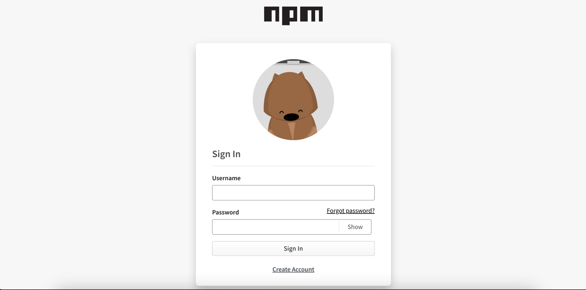

# npm 发布和更新

**官网地址：[npm](https://www.npmjs.com/)**

## 私有模块和公有模块

npm分为私有模块和公有模块

两者区别：
+ 私有模块只能在发布它的项目内使用，不能被其他项目依赖；公有模块可以被任何项目依赖
+ 私有模块的包名一般以 @ 或 \_ 开头,以表示它是私有的；公有模块的包名则不能以@、_等符号开头
+ 私有模块只能发布到私有的 npm registry，不能发布到 npm 官方站点；公有模块可以发布到 npm 官方站点，供所有人使用
+ 安装私有模块需要配置 .npmrc 文件,指定私有 registry 的地址；公有模块则直接使用官方 npm registry 安装
+ 私有模块不会出现在 npm 搜索结果中；公有模块会出现在搜索结果并显示下载统计数据。
+ 私有模块只在付费的 npm 团队版中支持；npm 的免费版只能用于公有模块

私有模块主要用于项目内部或企业内部共享代码，公有模块用于开源分享给所有人，选择公有或私有主要取决于代码的可见性需求。本文将以公有模块作为例子进行npm的发布与更新

## 注册

在npm官网使用邮箱注册一个账号


## 登录

本地登陆npm账号
```
$ npm login
# 然后输入自己的账号、密码以及邮箱
```

登录之后，可以执行`npm profile get`查看自己的信息，也可以使用`npm profile set xx xx`设置信息。

如果有多个账号，不确定登陆的账号是什么，可以通过`npm who am i`快速查看

```
$ npm profile get
┌─────────────────┬──────────────────────────────────┐
│ name            │ Shawkry                          │
├─────────────────┼──────────────────────────────────┤
│ email           │ Shawkry@gmail.com (verified)     │
├─────────────────┼──────────────────────────────────┤
│ two-factor auth │ disabled                         │
├─────────────────┼──────────────────────────────────┤
│ fullname        │ Shawkry                          │
├─────────────────┼──────────────────────────────────┤
│ homepage        │                                  │
├─────────────────┼──────────────────────────────────┤
│ freenode        │                                  │
├─────────────────┼──────────────────────────────────┤
│ twitter         │                                  │
├─────────────────┼──────────────────────────────────┤
│ github          │ Shawkry                          │
├─────────────────┼──────────────────────────────────┤
│ created         │ 2021-08-25T05:24:08.081Z         │
├─────────────────┼──────────────────────────────────┤
│ updated         │ 2021-08-25T06:57:07.287Z         │
└─────────────────┴──────────────────────────────────┘
$ npm profile set homepage shawkry.top
$ npm who am i
# shawkry
```

## 发布

1. 我们先在package.json中添加以下字段
```json
{
  "name": "elephant/poke",
  "version": "0.0.1",
  "description": "Elephant Design Poke",
  "author": {
    "name": "xxx",
    "email": "xxx@gmail.com",
    "url": "https://github.com/xxx"
  },
  "private": false,
  "files": [
    "dist"
  ]
}
```

2. rollup 打包（一定要先打包📦，再发布）
```shell
$ roll up -c
```

3. 运行npm publish
```shell
$ npm publish [package file]
```

## 更新

当更新部分功能时，需要升级版本号，才能重新发布。

```
npm version <version_type>
# version_type:
# patch: bug fixed x.x._
# minor: add feature x._.x
# major: update _.x.x
npm publish
```

也可以直接手动更改`package.json`文件的*version*字段进行手动更新，再进行发布。

## 版本管理
[npm verison](https://docs.npmjs.com/cli/v8/commands/npm-version)

npm的发包需要遵循语义化版本，一个版本号包含三个部分：MAJOR.MINOR.PATCH，

- MAJOR 表示主版本号，当你做了不兼容的API修改；
- MINOR 表示次版本号，当你做了向下兼容的功能性新增；
- PATCH 表示修订号,当你做了向下兼容的问题修正;

我们可以使用npm version 命令来自动修改版本号，比如：
```
// version = v1.0.0
npm version patch
// v1.0.1
npm version prepatch
// v1.0.2-0
npm version minor
// v1.1.0
npm version major
// v2.0.0
```

## 补充

为了适应不同的模块系统，都需要将写好的内容打包。一般我们使用的包都要支持以下特性：

- 不同的模块支持：针对不同的模块，打对应的包，然后进行相关的配置。`package.json`中有`main` `module` `unpkg`,分别支持设定 commonjs、esmodule 以及 umd。
- 类型提示：打包时，生成类型声明文件`d.ts`，并且配置`package.json`中的`typings`字段。
- 按需加载：按需加载是在 babel 编译过程中，按需引入相关代码。借助 babel 的插件`babel-plugin-import`，将不同的组件或者函数拆分开。
- 支持 Tree Shaking：Tree Shaking 是在 webpack 打包阶段，移除不相关的 js 代码。只需配置好`package.json`的`sideEffects`字段。
- package.json字段参考：[package.json](https://docs.npmjs.com/cli/v7/configuring-npm/package-json)
