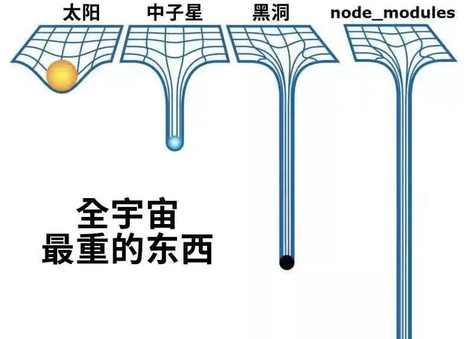

# package.json 依赖总结



## 一、 常见 dependency 介绍

**dependencies :** 项目主要依赖，最常用的，在`dependencies`里面的依赖都会被构建到部署环境里

**devDependencies :** 这里放置一些开发需要的依赖，不会打包到最终生产文件中，比如打包的rollup、格式化的eslint

**peerDependencies（重点）:** 不会重复安装依赖，一般具有`peerDependencies`的项目都不是最终项目，公共组件就是个很好的例子。

## 二、 peerDependencies

### 1. 公共组件为什么要用peerDependencies

1. 减少体积，避免不必要的重复安装（比如react库）
2. 减少版本冲突，将版本交由主要应用决定（再比如react库）

### 2. 特性

1. 如果用户显式依赖了核心库，则可以忽略各插件的 `peerDependencies` 声明；
2. 如果用户没有显式依赖核心库，则按照插件 `peerDependencies` 中声明的版本将库安装到项目根目录中；
3. 当用户依赖的版本、各插件依赖的版本之间不相互兼容，会报错让用户自行修复；

**举个栗子🌰：**

1. 没使用`peerDependencies`项目helloWorld执行 npm i之后的目录结构：

```json
.
├── helloWorld
│   └── node_modules
│       ├── dayjs
│       ├── ant-design
│       │   └── nodule_modules
│       │       └── dayjs
│       └── @ones-design
│       │   └── nodule_modules
│       │       └── dayjs
```

2. 使用`peerDependencies`的目录结构：

```json
// helloWorld 的 pagage.json
{
  "dependencies": {
    "dayjs": "1.0.1"
  }
}
// ant-design 和 @ones-design的pagage.json
{
  "dependencies": {
    "dayjs": "1.0.1"
  }
}
// helloWorld npm i 之后
.
├── helloWorld
│   └── node_modules
│       ├── dayjs
│       ├── ant-design
│       └── @ones-design
```

注：*peerDependenciesMeta可以让宿主应用执行npm install即使没有相关依赖时，安装过程中也不会警告提醒*

## 三、 相对使用频率较少的dependency

**optionalDependencies :** 相当于是个可选的`dependencies`，`dependencies` 在安装中出错会退出安装，`optionalDependencies`即使一些依赖安装失败也不影响最终应用运行，不过要做好相应模块容错处理。而且`optionalDependencies`会覆盖`dependencies`中的相同依赖

**bundledDependencies :** 如果期望一些依赖包能出现在最终打包的包里，用`bundledDependencies` 就对了，`bundledDependencies` 接收的是一个包含依赖名的数组

```json
{
  "bundledDependencies": [
    "react", "react-dom"
  ],
}
```